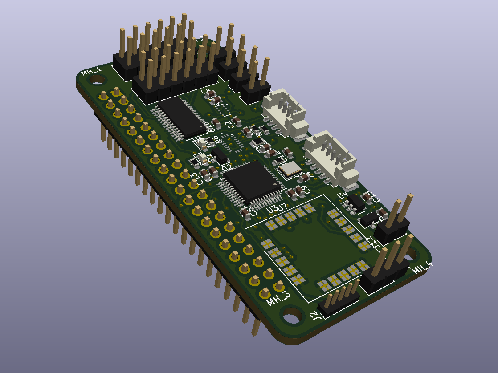

# Flight Control Shield for Raspberry Pi Zero

## Description
A small hobby electronics project - hardware interface 
for intelligent autonomous UAVs. The board is designed 
to be plugged into the Raspberry Pi Zero pin socket, to 
form a consistent flight control system. It is the 
same concept as Navio2 or the Navigator, but for a smaller board. 

## Onboard systems
* Main CPU - STM32F103CBT 
* IMU - BMX055
* Barometer - DPS310XTSA1
* ADC sensor ports
* 12 PWM ports - PCA9685PW
* Serial and I2C extension ports
* GNSS receiver - SAM M8Q

At the moment of designing (August 2022) these were all available on JLCPCB. 

## Firmware?

Not at this time :c Slightly tweaked ArduPilot (popular stuff, it is running on ChibiOS) will probably be a good fit.

